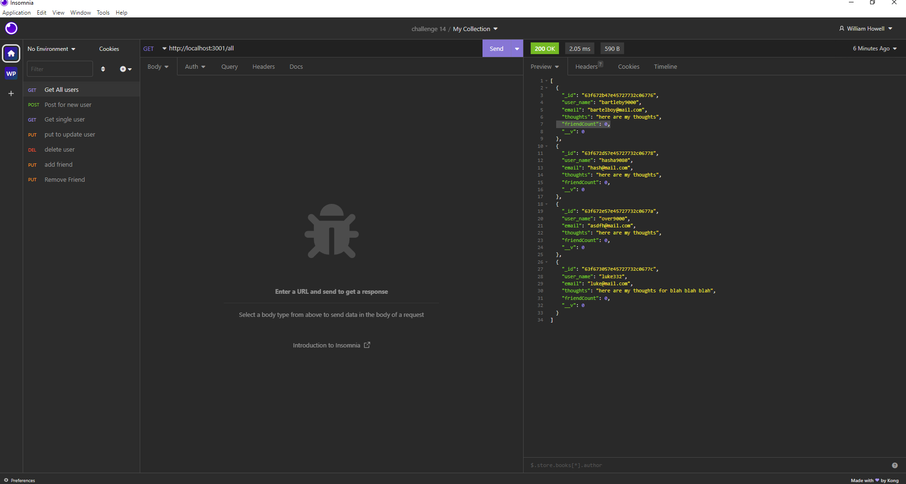

# social-network-api

## Links

-Video Link: https://drive.google.com/file/d/18oVCl17n_wMic6XwZAkehXL8_wJNVMPF/view
</br>
-GithubRepo: https://github.com/waustin45/social-network-api.git
</br>
-Github: https://github.com/waustin45

## Description
I built this app to give the user the ability to search through and update their database.

## User Story

```
As a user 
I want to see my database
When I see my database I want to an individual user
Then I want to be able to update that user
When the user is updated I want the ability to delete that user

I also want to see the friendCount
When I see the friendCount 
Then I want to add or remove friends
``` 

## Preview


